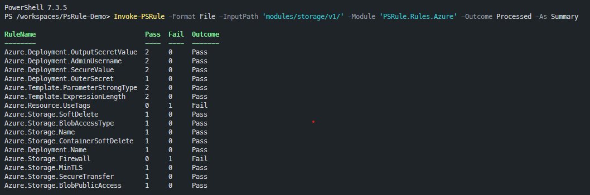

# How to use `PsRule` to analyse Bicep IaC templates #

In thinking how to explain what PsRule is and how it works I decided that using a specific implementation called `PsRule for Azure` to check a Bicep template is a good way to demonstrate how to use `PsRule` more generally.

[PsRule for Azure](https://azure.github.io/PsRule.Rules.Azure/about/) is a set of rules that you can use to analyse Bicep IaC templates against a set of rules that implement [Azure Well Architected Framework (WAF)](https://learn.microsoft.com/azure/architecture/framework/) principles

This is a 'simplest possible' sample project to show how to [use PsRule for Azure with a Bicep template](https://azure.github.io/PsRule.Rules.Azure/using-bicep/). It can also be used with ARM Templates and Terraform.

This example focusses on executing the rule-checking process locally on Windows or in a Dev Container (or GitHub Codespace) but it can also be used in a GitHub Action or Azure DevOps Pipeline.

## Running in a GitHub Codespace ##

This is the easiest option as all the dependencies are already installed in the Codespace.

[](https://codespaces.new/qnrl/PsRule-Demo?quickstart=1)

Then jump to [Executing PsRule](#executing-psrule)

## Running locally on Windows ##

1. Clone this repository to your local machine

2. If you haven't already, set up PsRule.Rules.Azure Modules and associated dependencies on your local machine.

    See also [local module installation](https://azure.github.io/PsRule.Rules.Azure/install-instructions/?WT.mc_id=modinfra-72253-socuff#getting-the-modules)

    ```powershell
    # In Powershell on Windows
    winget install -s winget -e --id "Microsoft.DotNet.Runtime.6"
    winget install -s winget -e --id "Microsoft.PowerShell"
    winget install -s winget -e --id "Microsoft.Bicep"

    Install-Module -Name 'Az' -Repository PSGallery -Force
    Install-Module -Name 'PsRule.Rules.Azure' -Repository PSGallery -Scope CurrentUser
    ```

3. Open the project in VS Code.

## Running in a Dev Container ##

1. Clone this repository to your local machine

2. Open the project in VS Code and click the 'Reopen in Container' button in the bottom right of the VS Code window

## Executing PsRule ##

1. Execute the following commands in Powershell to invoke PsRule for this project:

    In a Dev Container or GitHub Codespace you will have a Bash shell by default so you need to type `pwsh` to get a Powershell session.

    Run the following command in Powershell to invoke PsRule against all files in the `examples/` folder (there is just one Bicep template in this example)):

    ```powershell
    Invoke-PsRule -InputPath 'examples/' -Module 'PsRule.Rules.Azure' -Outcome Fail, Error -As Summary
    ```

    You should see output that looks like this:

    [](assets/psrule-invoke.png)

    You can also run the following variations to see what happens:

    ```powershell
    # In Powershell on Windows or in a Dev Container (Ubuntu Linux)
    Invoke-PsRule -InputPath 'examples/' -Module 'PsRule.Rules.Azure' -As Summary
    Invoke-PsRule -InputPath 'examples/' -Module 'PsRule.Rules.Azure'
    Invoke-PsRule -InputPath 'examples/' -Module 'PsRule.Rules.Azure' -As Summary -OutputPath 'output/summary.json'
    Assert-PsRule -Format File -InputPath 'examples/'  -Module 'PsRule.Rules.Azure' -Outcome Fail, Error
    ```

## Rule violations still to be fixed ##

For the sake of this demonstration, I have deliberately left some issues in the Bicep template that need to be fixed. When you run PsRule you should see that there are still some rules that show a **Fail**. Those are as follows:

|          Rule          |                                             Reference                                              |
| ---------------------- | -------------------------------------------------------------------------------------------------- |
| Azure.Resource.UseTags | <https://azure.github.io/PsRule.Rules.Azure/en/rules/Azure.Resource.UseTags/#configure-with-bicep> |
| Azure.Storage.Firewall | <https://azure.github.io/PsRule.Rules.Azure/en/rules/Azure.Storage.Firewall/#configure-with-bicep> |

## References ##

This project is inspired by this blog post - [PsRule: Introduction to Infrastructure As Code (IAC) Testing](https://techcommunity.microsoft.com/t5/itops-talk-blog/PsRule-introduction-to-infrastructure-as-code-iac-testing/ba-p/3580746)
